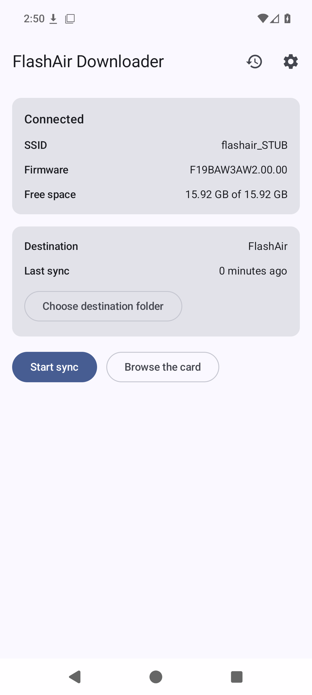

# FlashAir Downloader for Android



TOSHIBA FlashAir（無線 LAN 内蔵 SD カード）から HTTP 経由でファイルを
ダウンロードする Android アプリケーション。

設計は [docs/design.md](docs/design.md) を参照。

## 動作環境

- Android 16（API 36）以降

## できること

- FlashAir の Wi-Fi（インターネットに出られない Wi-Fi）に接続していれば、
  カード情報（SSID / ファームウェア / 空き容量）を表示する
- カード内のフォルダーを辿って一覧・サムネイル表示する
- 前回以降に増えたファイルだけを保存先（SAF で選んだフォルダー）へ
  ダウンロードする。画面を消しても継続する
- 設定: カードのアドレス、カード内の起点フォルダー、保存先、拡張子フィルター、
  同時ダウンロード数、ギャラリー登録
- 履歴: ダウンロード済み一覧、直近の失敗一覧、記録のリセット

## 開発環境

`.devcontainer` に JDK 21 と Android SDK が入っている。VS Code の
Dev Containers、Dev Container CLI、DevPod のいずれからでも起動できる。

- `JAVA_HOME=/usr/lib/jvm/java-21-openjdk-amd64`
- `ANDROID_HOME=/opt/android-sdk`（platform-tools, `platforms;android-37.0`,
  `build-tools;37.0.0`）

Gradle はリポジトリーに同梱した wrapper（Gradle 9.7.0）を使う。

## ビルドと検査

```sh
./gradlew assembleDebug              # デバッグ APK
./gradlew test                       # JVM 単体テスト（JUnit 5）
./gradlew connectedDebugAndroidTest  # 計装テスト（要エミュレーターまたは実機）
./gradlew ktlintCheck                # ktlint
./gradlew detekt                     # detekt
./gradlew lint                       # Android Lint
```

計装テストは Room・DataStore・Compose 画面など、JVM では動かせない部分を
実機（エミュレーター）上で確認する。事前に `tools/setup_emulator.sh` で
エミュレーターを起動しておく。

CI（`.github/workflows/ci.yml`）は計装テスト以外をまとめて実行する。

## エミュレーターでの動作確認

コンテナー内で API 36 のエミュレーターを動かせる（`/dev/kvm` が使える場合）。
エミュレーターとシステムイメージで約 2.8GB あるので Dockerfile には含めず、
必要になったときに `tools/setup_emulator.sh` で入れる。

```sh
tools/setup_emulator.sh                  # 導入・AVD 作成・起動（何度実行してもよい）
tools/setup_emulator.sh --no-start       # 導入と AVD 作成だけ
tools/setup_emulator.sh --route-to-stub  # 後述のスタブへ 192.168.0.1 を向ける
```

```sh
./gradlew installDebug
adb shell am start -n org.j96.flashairdownloader.debug/org.j96.flashairdownloader.ui.MainActivity
```

`-no-window` で動かすので、画面の確認は
`adb shell uiautomator dump /sdcard/ui.xml` の結果を読む。

### FlashAir スタブと組み合わせる

`tools/flashair-stub.rb` が FlashAir 互換の HTTP サーバー（設計書 10 の
「疑似実機」）で、`tools/fixtures/card` を SD カードの中身として配信する。

```sh
ruby tools/flashair-stub.rb --root tools/fixtures/card --port 8080 &
```

`--throttle 300000` を付けると転送を遅くできる（キャンセルや再接続の確認用）。
`--ranges` を付けると Range リクエストに 206 で答える（既定は実機同様に無視）。

エミュレーターからは、ホストが `10.0.2.2` に見える。アプリが接続するのは
既定で `192.168.0.1` なので、エミュレーター内で宛先を書き換える。これは
`tools/setup_emulator.sh --route-to-stub` がやってくれる（中身は次のとおり）。

```sh
adb root
adb shell iptables -t nat -A OUTPUT -p tcp -d 192.168.0.1 --dport 80 \
  -j DNAT --to-destination 10.0.2.2:8080
```

これでアプリは実機と同じコードパスのまま、スタブのカードを読む。
fixture にはカンマ入りのファイル名と非 ASCII のファイル名が入っている。

## SDK バージョンの方針

- `minSdk` / `targetSdk` = 36（Android 16）: 対応端末を決める値。設計どおり。
- `compileSdk` = 37: 現行の AndroidX が「API 37 以降でコンパイルすること」を
  要求するため 1 世代先にしている。コンパイル時に見える API が増えるだけで、
  動作対象の端末は変わらない。
